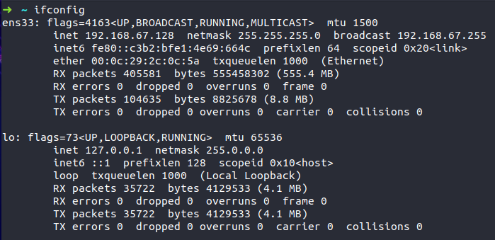

# Custom-MADE Setup in Windows

Custom-MADE is intended to be used on Linux. Therefore, developing on Windows or MacOS is difficult. 

To overcome this difficulty, this guide shall help the developer. 

## Docker Setup

There is a predefined Debian Image, that comes with the dependencies needed to run Custom-MADE.

1. First install Docker (for instructions, see [Get Docker](https://docs.docker.com/get-docker/)).

2. `docker docker pull richterrobert/custom-made:version1` 

3. Run the image inside a Docker container (and the necessary ports): `docker run -d -p 3000:3000 -p 3001:3001 -p 8080:8080 -p 22:22 custom-made`

4. Execute a CLI inside a Docker container (alternatively also available over SSH):
   
   1. `docker exec -it <container-name> /bin/bash`

5. Clone the repository and start working!

## VM Setup

First install a *Virtual Machine* software on your system. The user can use one of the following:

- Oracle VM
- VMware Workstation Player
- Docker

Oracle VM and VMware are the easiest to install, but Docker is the most efficient one (only for experienced users!). 

1. Install a Ubuntu distribution with SSH support. It is recommended to install Ubuntu Server. 

2. Determine the ip address of your virtual machine. 



3. 
4. Install Visual Studio Code & the extension *Remote - SSH*.


4. In the bottom left corner, click on the green SSH symbol and connect to the virtual machine. It usually follows the syntax 
   
   ```
   ssh yourusername@vmipaddress
   ```

Now you are ready to develop Custom-MADE on your local machine by using the Linux setup. 