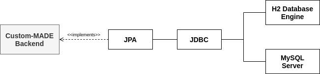

# Database Documentation

## Target

To persist data one needs to add a database. This is related to [Issue #22 Integrate User Management](https://github.com/schubmat/Custom-MADE/issues/22).

## Dependencies

The base system can be configured, so that it runs out-of-the-box. But to get persistent storage, you have to be running an instance of **MySQL**.

## Implementation

The following describes how the system is constructed and how it can be changed. 

#### Architecture

The system uses a typical Spring database architecture.

It implements the two APIs *Jakarta Persistence API (JPA)* and *Java Database Connectivity (JDBC)* to connect to a database. The configuration can be found under the class `de.btu.swt.backend.datasource.DataSourceConfiguration`. It automatically uses the parameters set in `resources/application.properties`. The required parameters are described later on.

The database system which is connected to the backend can be configured to use either a persistent MySQL Server or an in-memory H2 Database Engine. 

*The in-memory database is only intended for testing purposes.*

#### Configuration

The file `resources/application.properties` configures the attributes of the system. The Custom-MADE database system supports the following attributes:

- `app.datasource.persistent` : true | false
  The persistence flag determines, if a persistent database should be used (MySQL) or not (H2DB).

